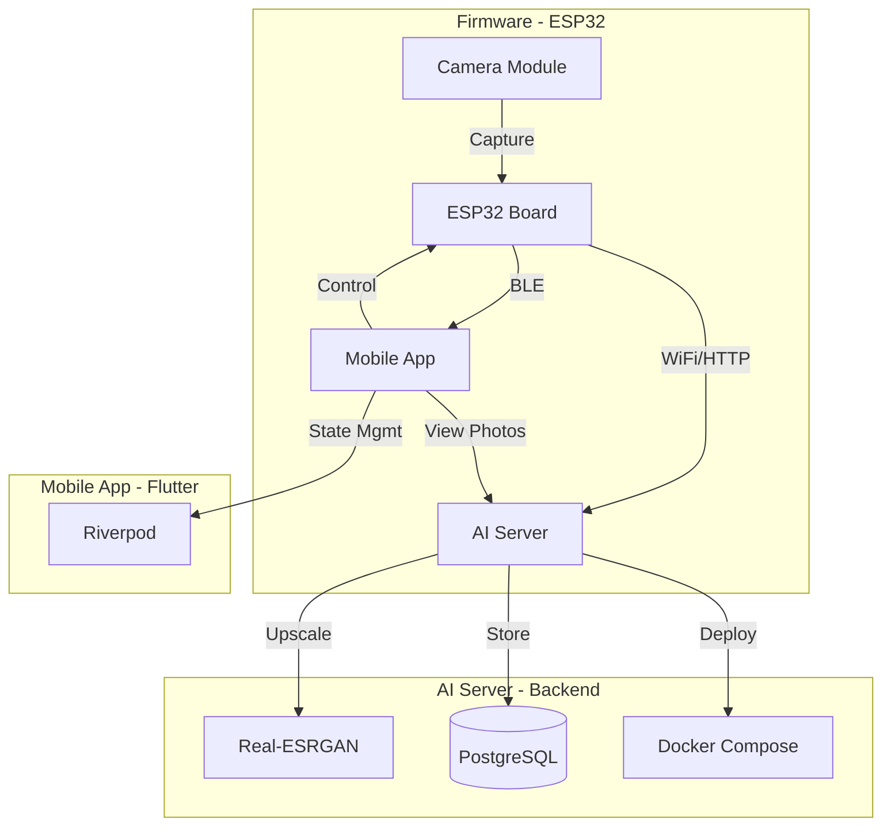

# 📸 PetCam Project

**PetCam**은 ESP32 기반의 저전력 카메라, AI 업스케일링 서버, 그리고 크로스 플랫폼 모바일 앱으로 구성된  
**지능형 반려동물 모니터링 시스템**입니다.

> ✅ 저전력 촬영(ESP32-CAM) → ✅ 업로드(HTTP) → ✅ 서버 업스케일(Real-ESRGAN) → ✅ 앱에서 갤러리 탐색

---

## ✨ What You Can Do

- 📷 **Capture & Upload** : ESP32-CAM 촬영 → Wi-Fi로 서버 업로드
- 🧠 **AI Upscale** : Real-ESRGAN 기반 고화질 변환
- 📱 **Mobile Gallery** : Infinite Scroll 기반 빠른 탐색
- 🛰️ **BLE Control** : 근거리 제어(촬영/설정)
- 🗺️ **Location View** : Naver Map으로 촬영 위치 확인

---

## 🏗️ System Architecture

## 🚀 Key Features
<table> <tr> <td width="33%" valign="top"> <h3>📱 Mobile App</h3> <ul> <li><b>Infinite Scroll</b> — 끊김 없는 갤러리 탐색</li> <li><b>BLE Control</b> — 근거리 카메라 제어</li> <li><b>Naver Map</b> — 촬영 위치 지도 표시</li> <li><b>Riverpod</b> — 안정적인 상태관리</li> </ul> </td>
<td width="33%" valign="top">
  <h3>🧠 AI Server</h3>
  <ul>
    <li><b>Real-ESRGAN</b> — Super Resolution 업스케일</li>
    <li><b>Async Pipeline</b> — 비동기 처리로 확장성 확보</li>
    <li><b>PostgreSQL</b> — 이미지/메타데이터 저장</li>
    <li><b>Docker</b> — 환경 분리 및 보안 설정</li>
  </ul>
</td>

<td width="33%" valign="top">
  <h3>📷 Firmware</h3>
  <ul>
    <li><b>Deep Sleep</b> — 저전력 배터리 최적화</li>
    <li><b>Smart Config</b> — 간편 Wi-Fi 설정</li>
    <li><b>Reliable Upload</b> — 안정적 HTTP 업로드</li>
  </ul>
</td>

</tr> </table>

## 🧰 Tech Stack
<table> <tr> <td width="22%"><h3>Frontend</h3></td> <td>Flutter · Riverpod · GoRouter · Dio</td> </tr> <tr> <td><h3>Backend</h3></td> <td>FastAPI · SQLAlchemy (Async) · AsyncPG</td> </tr> <tr> <td><h3>Database</h3></td> <td>PostgreSQL</td> </tr> <tr> <td><h3>AI/ML</h3></td> <td>Real-ESRGAN · PyTorch</td> </tr> <tr> <td><h3>DevOps</h3></td> <td>Docker · Docker Compose · Nginx</td> </tr> <tr> <td><h3>Hardware</h3></td> <td>ESP32-CAM (PlatformIO, C++)</td> </tr> </table>

## 📂 Directory Structure
<pre><code>PetCam_Project/
  ├── ai_server/ # Backend (FastAPI + Docker) 
  ├── mobile_app/ # Frontend (Flutter) 
  └── firmware/ # Embedded (ESP32-CAM, C++)</code></pre>

## 🏁 Getting Started
✅ Prerequisites

Docker & Docker Compose

Flutter SDK

VS Code + PlatformIO Extension

### 1) 🧠 AI Server Setup (FastAPI + Docker)
<pre><code>cd ai_server # .env 파일 생성 및 설정 (DATABASE_URL 등) docker-compose up --build -d</code></pre>

Server URL: <code>http://localhost:8000
</code>

### 2) 📱 Mobile App Setup (Flutter)
<pre><code>cd mobile_app flutter pub get flutter run</code></pre>

### 3) 📷 Firmware Setup (ESP32-CAM)

VS Code에서 <code>/firmware</code> 폴더 열기

ESP32-CAM 연결

PlatformIO에서 <b>Upload</b> 실행

## 🔐 Environment Variables (.env)
<pre><code>DATABASE_URL=postgresql+asyncpg://USER:PASSWORD@db:5432/petcam API_HOST=0.0.0.0 API_PORT=8000</code></pre>

✅ <b>.env</b> 파일은 Git에 커밋하지 않는 것을 권장합니다. (<code>.gitignore</code>)

## 🧩 Roadmap
<table> <tr> <td width="12%"><h3>Status</h3></td> <td><h3>Task</h3></td> </tr> <tr> <td>⬜</td> <td>실시간 스트리밍(저전력 모드 병행)</td> </tr> <tr> <td>⬜</td> <td>이벤트 기반 촬영(움직임 감지)</td> </tr> <tr> <td>⬜</td> <td>사진/업스케일 작업 큐 모니터링 대시보드</td> </tr> <tr> <td>⬜</td> <td>사용자 인증(Auth) / 권한 관리</td> </tr> </table>
👤 Author

Developed by <b>Mingun Kim</b>
